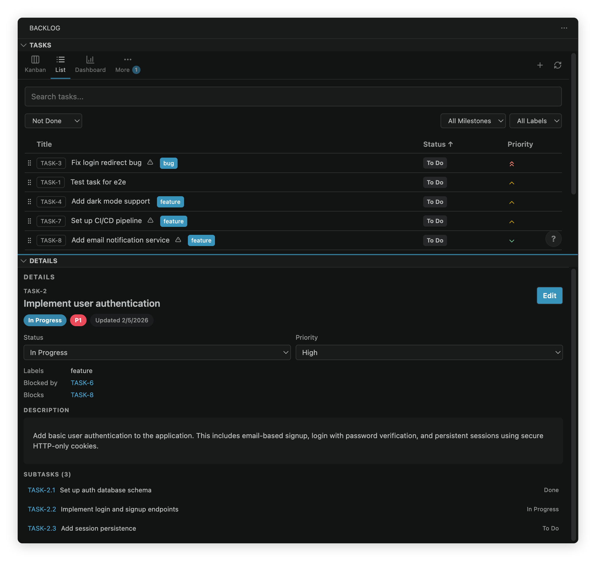
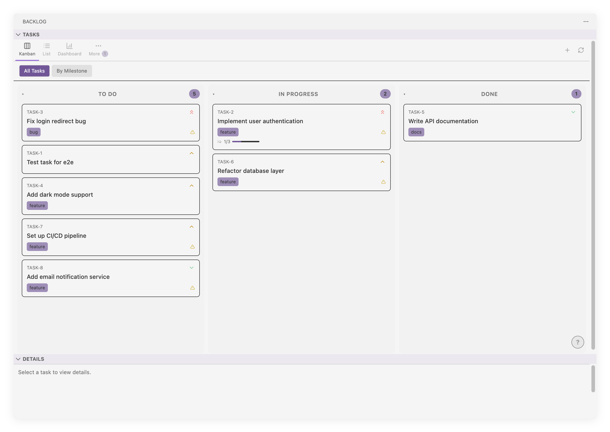

# Backlog.md for VS Code

[](https://marketplace.visualstudio.com/items?itemName=ysamlan.vscode-backlog-md)
[](https://open-vsx.org/extension/ysamlan/vscode-backlog-md)
[](https://code.visualstudio.com/)
[](https://opensource.org/licenses/MIT)

A VS Code extension for browsing and managing [Backlog.md](https://github.com/backlog-md/backlog) tasks directly in your editor.

Backlog.md is human-friendly and machine-accessible tool for managing a project task list and backlog in Markdown format.

You can think of it as Trello or a lightweight Jira - but that lives right in your repo, and that both humans and AI agents can collaborate on.





## Features

- **Kanban Board** — Drag-and-drop tasks between status columns (Draft, To Do, In Progress, Done)
- **Task List** — Sortable, filterable table view with search and column customization
- **Rich Markdown rendering** — Including styling and [Mermaid.js](https://mermaid.js.org/) diagrams
- **Format-aware editing** — Status dropdowns, quick linking of dependencies, Markdown shortcuts in descriptions, and checklist management for acceptance criteria / definition-of-done
- **Real-time Sync** — File watcher automatically syncs changes from disk
- **Editor Intelligence** — Autocomplete, clickable links, and hover info for Markdown task files
- **Multi-backlog workspaces** — Switch between multiple backlog folders in the same workspace
- **Advanced feature support** — Supports Backlog.md options like remote/cross-branch tasks
- **Project-aware setup** — One-command setup for Backlog.md CLI
- **Theme Support** — Plays nice with Light, Dark, and High Contrast themes

<details>
<summary>More screenshots</summary>


</details>

## Installation

### From a Marketplace

The extension is available on both the [VS Code Marketplace](https://marketplace.visualstudio.com/items?itemName=ysamlan.vscode-backlog-md) and [Open VSX](https://open-vsx.org/extension/ysamlan/vscode-backlog-md).

1. Open VS Code (or a compatible editor like VSCodium for Open VSX)
2. Go to Extensions (Ctrl+Shift+X / Cmd+Shift+X)
3. Search for "Backlog.md"
4. Click Install

### From VSIX File

1. Download the `.vsix` file from [GitHub Releases](https://github.com/ysamlan/vscode-backlog-md/releases)
2. In VS Code, open the Command Palette (Ctrl+Shift+P / Cmd+Shift+P)
3. Run "Extensions: Install from VSIX..."
4. Select the downloaded file

## Getting Started

The extension activates when it detects a project set up by Backlog.md (`backlog/config.yml` or `backlog/tasks/*.md`).

If you haven't already installed and initialized [backlog.md](https://backlog.md/), the extension will guide you through it when you open it.

## Editor Intelligence

When you open a backlog task file (e.g., via "Open Markdown" or by opening a `.md` file inside `backlog/tasks/`), the extension provides smart editor features on top of the normal Markdown editing experience:

- **Frontmatter autocomplete** — Context-aware suggestions when editing `status:`, `priority:`, `milestone:`, `labels:`, `assignee:`, and `dependencies:` fields. Milestones are sourced from `backlog/milestones/*.md` first (with config fallback), and other values come from `config.yml` and existing tasks.
- **Task ID autocomplete** — Type a task prefix (e.g., `TASK-`) anywhere in the body or in `dependencies:` to see suggestions of all known task IDs with their titles.
- **Clickable task links** — Task IDs like `TASK-42` in the document body become clickable links that open the referenced task's detail view.
- **Hover info** — Hover over any task ID to see a tooltip with the task's title, status, priority, milestone, labels, and a description preview.

## Keyboard Shortcuts

Press `?` in the tasks view to see all shortcuts, or use the `?` button in the bottom-right corner.

| Key       | Action                               |
| --------- | ------------------------------------ |
| `?`       | Show keyboard shortcuts              |
| `z`       | Kanban view                          |
| `x`       | List view                            |
| `c`       | Drafts view                          |
| `v`       | Archived view                        |
| `j` / `k` | Next / previous task                 |
| `h` / `l` | Previous / next column (kanban)      |
| `Enter`   | Move keyboard focus to details panel |
| `/`       | Focus search                         |
| `n`       | Create new task                      |
| `e`       | Open edit view for focused task      |
| `r`       | Refresh views                        |
| `Esc`     | Close popup                          |

## Commands

Open the Command Palette (Ctrl+Shift+P / Cmd+Shift+P) and type "Backlog":

| Command                               | Description                                               |
| ------------------------------------- | --------------------------------------------------------- |
| **Backlog: Initialize Backlog**       | Set up a new backlog in the current workspace             |
| **Backlog: Open Kanban Board**        | Open the Kanban board view                                |
| **Backlog: Open Task List**           | Open the task list view                                   |
| **Backlog: Open Dashboard**           | Open the dashboard overview                               |
| **Backlog: Show Documents**           | Browse project documents                                  |
| **Backlog: Show Decisions**           | Browse decision records                                   |
| **Backlog: Create Task**              | Create a new task file                                    |
| **Backlog: Open Task Markdown**       | Open the raw Markdown file for the current task           |
| **Backlog: Select Active Backlog**    | Switch backlogs (in a multi-folder workspace)             |
| **Backlog: Set Up Agent Integration** | Install Backlog.md CLI and configure AI agent integration |
| **Backlog: Refresh**                  | Refresh tasks from disk                                   |

## Settings

Configure extension settings in VS Code Settings (`Ctrl+,` / `Cmd+,`), then search for `Backlog`.

### Task ID Display

Use `backlog.taskIdDisplay` to control how task IDs appear in card and list views:

- `full` (default): `TASK-123`
- `number`: `123` (or `2.1` for subtask IDs like `TASK-2.1`)
- `hidden`: do not show task IDs

You can also set it in `settings.json`:

```json
{
  "backlog.taskIdDisplay": "full"
}
```

## Requirements

- VS Code 1.108.0 or later
- A workspace containing a `backlog/` folder set up through Backlog.md's `backlog init`

## Contributing

Please read our [Contributing Guidelines](CONTRIBUTING.md) for development setup and guidelines before submitting a pull request.

## License

MIT — see [LICENSE](LICENSE) for details.
