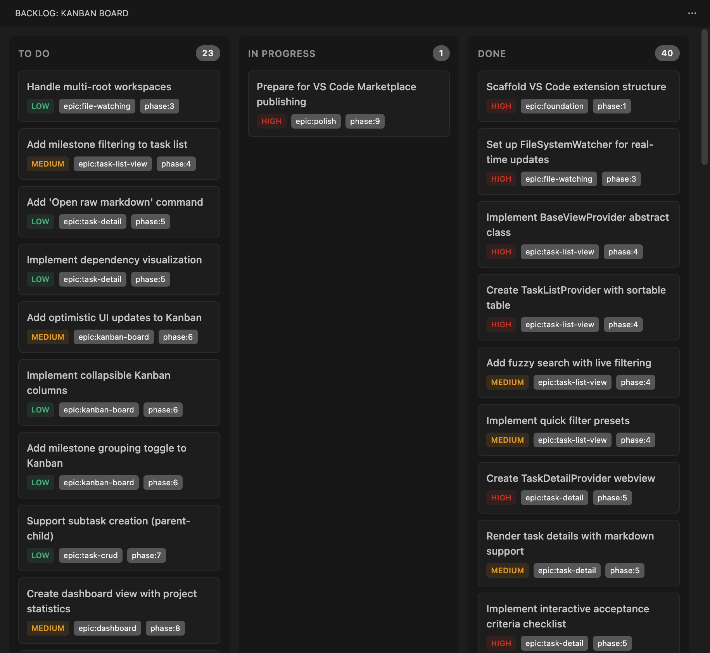
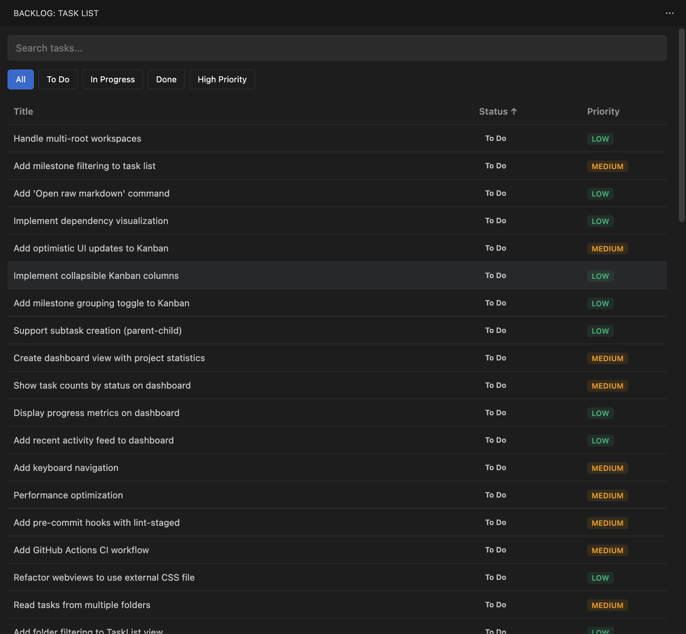

# Backlog.md for VS Code

[](https://code.visualstudio.com/)
[](https://opensource.org/licenses/MIT)

A beautiful VS Code extension for browsing and managing [Backlog.md](https://github.com/backlog-md/backlog) tasks directly in your editor.





## Features

- **Kanban Board** — Drag-and-drop tasks between status columns (Draft, To Do, In Progress, Done)
- **Task List** — Sortable, filterable table view with search and column customization
- **Task Detail** — Rich view with inline editing for title, description, priority, status, assignees, and labels
- **Real-time Sync** — File watcher automatically syncs changes from disk
- **Theme Support** — Works with Light, Dark, and High Contrast themes

<details>
<summary>More screenshots</summary>


</details>

## Installation

### From VS Code Marketplace

1. Open VS Code
2. Go to Extensions (Ctrl+Shift+X / Cmd+Shift+X)
3. Search for "Backlog.md"
4. Click Install

### From VSIX File

1. Download the `.vsix` file from [Releases](https://github.com/ysamlan/vscode-backlog-md/releases)
2. In VS Code, open the Command Palette (Ctrl+Shift+P / Cmd+Shift+P)
3. Run "Extensions: Install from VSIX..."
4. Select the downloaded file

## Getting Started

1. Create a `backlog/tasks/` folder in your workspace
2. Add Markdown task files with YAML frontmatter (see format below)
3. Click the **Backlog** icon in the Activity Bar to view your tasks

The extension activates automatically when it detects `backlog/tasks/*.md` files.

## Task File Format

Tasks are Markdown files with YAML frontmatter:

```markdown
---
title: Implement user authentication
status: In Progress
priority: high
assignee:
  - alice
  - bob
labels:
  - backend
  - security
---

## Description

Add JWT-based authentication to the API endpoints.

## Acceptance Criteria

- [ ] Login endpoint returns JWT token
- [ ] Protected routes validate token
- [ ] Token refresh mechanism works
```

### Supported Fields

| Field      | Values                                  |
| ---------- | --------------------------------------- |
| `status`   | `Draft`, `To Do`, `In Progress`, `Done` |
| `priority` | `high`, `medium`, `low`                 |
| `assignee` | List of usernames                       |
| `labels`   | List of tags                            |

## Commands

Open the Command Palette (Ctrl+Shift+P / Cmd+Shift+P) and type "Backlog":

| Command                        | Description                 |
| ------------------------------ | --------------------------- |
| **Backlog: Open Kanban Board** | Open the Kanban board view  |
| **Backlog: Open Task List**    | Open the task list view     |
| **Backlog: Open Dashboard**    | Open the dashboard overview |
| **Backlog: Create Task**       | Create a new task file      |
| **Backlog: Refresh**           | Refresh tasks from disk     |

## Requirements

- VS Code 1.108.0 or later
- A workspace containing `backlog/tasks/*.md` files

## Development

This project uses [Mise](https://mise.jdx.dev/) for version management (Node.js 22 + Bun).

```bash
# Install tools via mise
mise install

# Install dependencies
bun install

# Build the extension
bun run build

# Watch mode for development
bun run watch
```

Press **F5** to launch the Extension Development Host and test the extension.

### Pre-commit Hooks

This project uses [husky](https://typicode.github.io/husky/) and [lint-staged](https://github.com/lint-staged/lint-staged) to run linting and formatting on staged files before each commit.

After cloning the repository and running `bun install`, the hooks are automatically set up via the `prepare` script. Each commit will:

- Run ESLint with auto-fix on staged `.ts` files
- Run Prettier on staged `.ts`, `.js`, `.json`, `.md`, `.yml`, `.yaml`, `.css`, and `.html` files

### Testing

```bash
# Unit tests (core logic)
bun run test

# Webview UI tests (Cypress)
bun run test:webview

# Extension e2e tests
bun run test:e2e

# Linting and type checking
bun run lint
bun run typecheck
```

See [CONTRIBUTING.md](CONTRIBUTING.md) for more details.

## Contributing

Contributions are welcome! Please read our [Contributing Guidelines](CONTRIBUTING.md) before submitting a pull request.

## License

MIT — see [LICENSE](LICENSE) for details.
