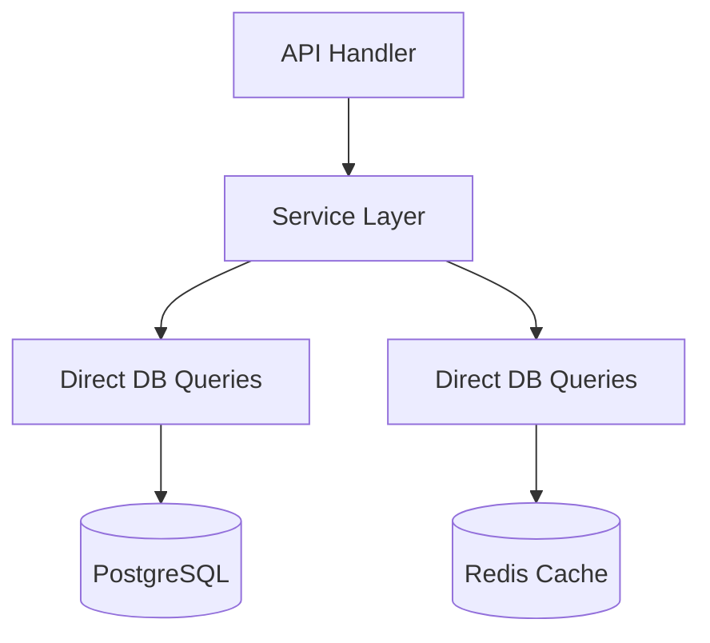
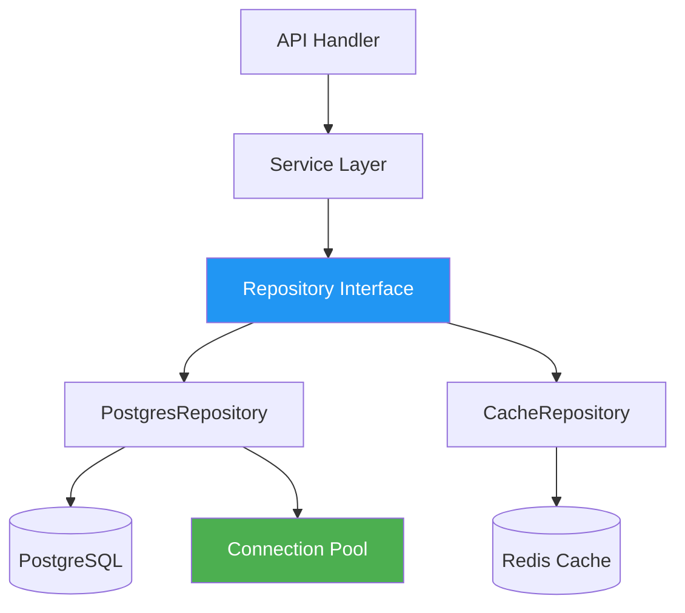
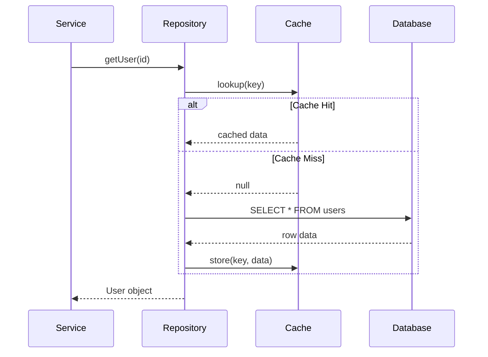

# Refactor database layer

## Description

This task has no milestone assigned to test the "no milestone" case.

### Current Architecture

### Target Architecture

### Sequence: Query with Cache

## Acceptance Criteria

- [ ] Extract database logic into repository pattern
- [ ] Add connection pooling
