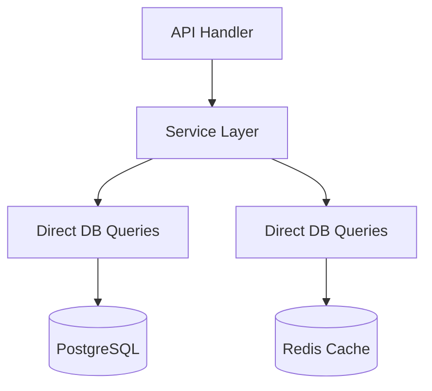
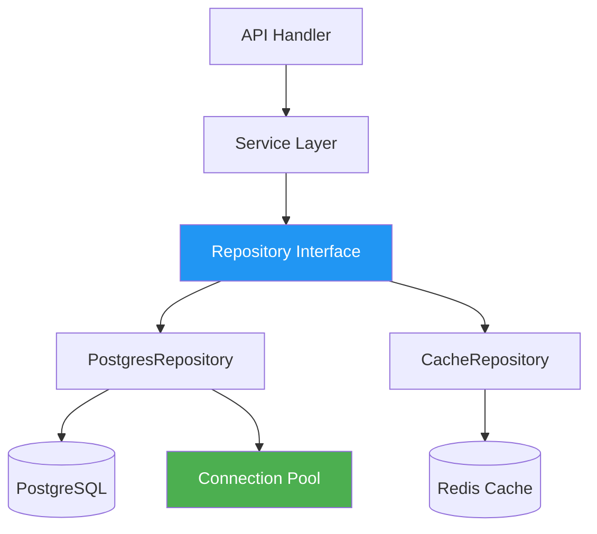
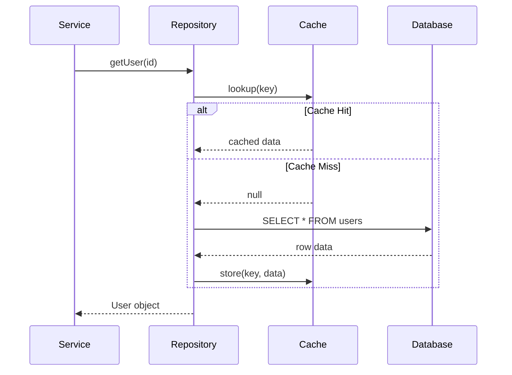

## Description

<!-- SECTION:DESCRIPTION:BEGIN -->
This task has no milestone assigned to test the "no milestone" case.

### Current Architecture

### Target Architecture

### Sequence: Query with Cache

<!-- SECTION:DESCRIPTION:END -->

## Acceptance Criteria
<!-- AC:BEGIN -->
- [x] #1 Extract database logic into repository pattern
- [ ] #2 Add connection pooling
<!-- AC:END -->

## Definition of Done
<!-- DOD:BEGIN -->
- [ ] #1 All existing queries migrated to repository pattern
- [ ] #2 Connection pool configured with sensible defaults
- [ ] #3 Integration tests pass against test database
<!-- DOD:END -->

## Implementation Plan

<!-- SECTION:PLAN:BEGIN -->
1. Define `Repository` interface with CRUD methods
2. Implement `PostgresRepository` backed by connection pool
3. Implement `CacheRepository` as a read-through wrapper
4. Migrate existing direct queries one module at a time
5. Add connection pool health checks
<!-- SECTION:PLAN:END -->

## Implementation Notes

<!-- SECTION:NOTES:BEGIN -->
Investigated both `pg-pool` and `pgBouncer`. Going with `pg-pool` for simplicity since we don't need cross-service pooling yet.

The `users` table queries were migrated first as a proof of concept — all 12 tests pass with the new repository layer.
<!-- SECTION:NOTES:END -->

## Final Summary

<!-- SECTION:FINAL_SUMMARY:BEGIN -->
Repository pattern is in place for the `users` and `sessions` modules. Cache layer uses a 60-second TTL with LRU eviction. Connection pool is configured at 10 idle / 50 max connections. Remaining modules (`audit_log`, `preferences`) will be migrated in TASK-9.
<!-- SECTION:FINAL_SUMMARY:END -->
